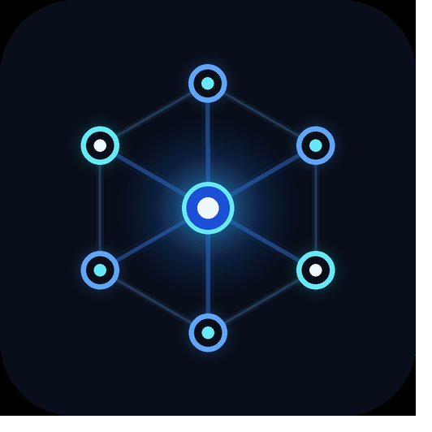

# 

# MCP Demo

**[mcpdemo.com](https://mcpdemo.com) — Servers · Clients · Demonstrations**

---

## What Is MCP Demo?

MCP Demo is the easiest way to understand what the **Model Context Protocol (MCP)** is — and why it matters.

Instead of reading a technical spec, you can come here and *see it work*. Every tool on this site is a live, real connection between Claude AI and an actual service. Not a mockup. Not a simulation. Real data, returned in real time.

---

## What Is the Model Context Protocol?

MCP is an open standard that lets AI models like Claude connect to the tools and services you already use — your calendar, email, GitHub, spreadsheets, databases, and hundreds more.

Without MCP, AI assistants can only work with information you paste into a chat window. With MCP, Claude can:

- Check your calendar and schedule a meeting
- Read and send emails
- Create GitHub issues and review pull requests
- Query a database and summarize the results
- Search the web for current information

MCP is the bridge between what AI *knows* and what AI can actually *do*.

---

## How to Use This Site

**1. Browse the Tools Directory**  
Visit [mcpdemo.com/tools](https://mcpdemo.com/tools) to see all the MCP tools we've showcased. Filter by category — Productivity, Developer Tools, Communication, Data & Analytics, and more.

**2. Read the Info Page**  
Each tool has a plain-English explanation of what it does, how MCP connects it, and real-world examples of what you can ask.

**3. Try the Live Demo**  
Click "Try the Demo" on any tool page. You'll see suggested prompts you can use — or type your own question. The response comes back from the actual service via a live MCP connection.

**4. Understand What Happened**  
Each demo shows you which MCP tool was called, so you can see exactly how the connection works under the hood.

---

## Stay in the Loop

MCP is moving fast. New tools, new capabilities, and new integrations are being added regularly.

Subscribe to our newsletter at [mcpdemo.com](https://mcpdemo.com) to get updates when new demos go live.

---

## About

MCP Demo is operated by **Effinsoftware.com, INC.**, a Wyoming corporation, doing business as MCP Demo.

- **Website:** [mcpdemo.com](https://mcpdemo.com)
- **Email:** [robert@mcpdemo.com](mailto:robert@mcpdemo.com)
- **Address:** 2232 Dell Range Blvd, Suite 245-3069, Cheyenne, WY 82009

---

## Legal

- [Privacy Policy](https://mcpdemo.com/legal/privacy-policy.html)
- [Terms of Service](https://mcpdemo.com/legal/terms-of-service.html)
- [Cookie Policy](https://mcpdemo.com/legal/cookie-policy.html)
- [Affiliate Disclosure](https://mcpdemo.com/legal/affiliate-disclosure.html)

---

*MCP Demo is not affiliated with Anthropic, Google, or any third-party service demonstrated on this site.*
